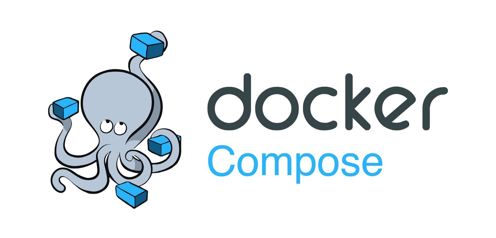

<div align="center" id="top"> 
  

  &#xa0;

  <!-- <a href="https://dockercomposeterraformbashautomation.netlify.app">Demo</a> -->
</div>

<h1 align="center">Flask API Containerization and Deployment</h1>

<p align="center">

  [](https://github.com/devenes/docker-compose-terraform-bash-api-automation/actions/workflows/terraform.yml)

  

  

  

  

  <!--  -->

  <!--  -->

  <!--  -->
</p>

<!-- Status -->

<!-- <h4 align="center"> 
	🚧  Docker Compose Terraform Bash Automation 🚀 Under construction...  🚧
</h4> 

<hr> -->

<p align="center">
  <a href="#dart-about">About</a> &#xa0; | &#xa0; 
  <a href="#rocket-technologies">Technologies</a> &#xa0; | &#xa0;
  <a href="#white_check_mark-requirements">Requirements</a> &#xa0; | &#xa0;
  <a href="#checkered_flag-starting">Starting</a> &#xa0; | &#xa0;
  <a href="#memo-license">License</a> &#xa0; | &#xa0;
  <a href="https://github.com/devenes" target="_blank">Author</a>
</p>

<br>

## :dart: About ##

Python Flask API Containerization and Deployment on AWS Cloud with Docker Compose and Terraform using Bash Scripts and GitHub Actions

## :rocket: Technologies ##

The following tools were used in this project:

- [Terraform](https://www.terraform.io/)
- [Docker](https://www.docker.com/)
- [Docker Compose](https://docs.docker.com/compose/overview/)
- [Bash](https://devhints.io/bash)
- [Python](https://www.python.org/)
- [Git](https://git-scm.com/)
- [Github](https://github.com)
- [AWS](https://aws.amazon.com/)
- [GitHub Actions](https://github.com/actions)

## :white_check_mark: Requirements ##

Before starting :checkered_flag:, you need to have [Git](https://git-scm.com) and [Terraform](https://www.terraform.io/) installed.

## :checkered_flag: Starting ##

```bash
# Clone this project
git clone https://github.com/devenes/docker-compose-terraform-bash-automation
```

```bash
# Access the project folder
cd docker-compose-terraform-bash-automation
```

```bash
# Install Terraform providers
terraform init
```

```bash
# Run Terraform
terraform apply -auto-approve
```


## Expected Server Output


## Expected Terraform Output


## :memo: License ##

This project is under license from Apache. For more details, see the [LICENSE](LICENSE) file.


Made with :heart: by <a href="https://github.com/devenes" target="_blank">devenes</a>

&#xa0;

<a href="#top">Back to top</a>
